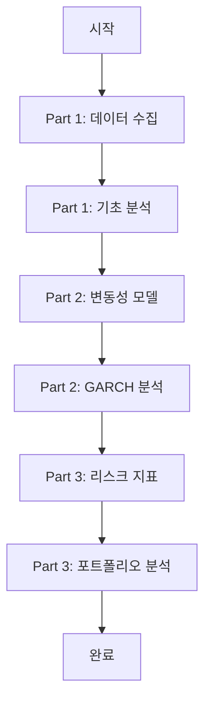

# 프로젝트 구조

```
sp500_risk_analysis/
│
├── README.md                           # 프로젝트 메인 설명서
├── QUICKSTART.md                       # 빠른 시작 가이드
├── requirements.txt                    # 필요 라이브러리 목록
├── .gitignore                         # Git 제외 파일 설정
│
├── part1_data_collection/              # Part 1: 데이터 수집 및 기초 분석
│   ├── README.md                       # Part 1 상세 설명
│   ├── data_collector.py               # S&P 500 데이터 다운로드
│   ├── basic_analysis.py               # 기초 통계 분석
│   │
│   └── [생성되는 파일들]
│       ├── sp500_data.csv              # 원본 데이터
│       ├── sp500_returns.csv           # 수익률 데이터
│       ├── basic_statistics.txt        # 통계량 리포트
│       ├── price_chart.png             # 가격 차트
│       ├── returns_distribution.png    # 수익률 분포
│       └── returns_histogram.png       # 히스토그램
│
├── part2_volatility_analysis/          # Part 2: 변동성 분석
│   ├── README.md                       # Part 2 상세 설명
│   ├── volatility_models.py            # 변동성 계산
│   ├── garch_analysis.py               # GARCH 모델
│   │
│   └── [생성되는 파일들]
│       ├── volatility_measures.csv     # 변동성 측정값
│       ├── volatility_comparison.png   # 변동성 비교
│       ├── rolling_volatility.png      # 이동평균 변동성
│       ├── volatility_clustering.png   # 변동성 클러스터링
│       ├── garch_results.txt           # GARCH 결과
│       ├── garch_conditional_volatility.png  # 조건부 변동성
│       ├── garch_forecast.png          # 변동성 예측
│       └── garch_diagnostics.png       # 모델 진단
│
└── part3_risk_measurement/             # Part 3: 리스크 측정
    ├── README.md                       # Part 3 상세 설명
    ├── risk_metrics.py                 # 리스크 지표 계산
    ├── portfolio_analysis.py           # 포트폴리오 분석
    │
    └── [생성되는 파일들]
        ├── risk_metrics.csv            # 리스크 지표
        ├── performance_metrics.txt     # 성과 지표
        ├── var_analysis.png            # VaR 분석
        ├── drawdown_analysis.png       # Drawdown 분석
        ├── risk_return_profile.png     # 리스크-수익 프로파일
        ├── stress_scenarios.png        # 스트레스 시나리오
        ├── distribution_analysis.png   # 분포 분석
        └── summary_dashboard.png       # 요약 대시보드
```

## 파일 설명

### 📁 설정 파일
- **README.md**: 프로젝트 전체 개요
- **QUICKSTART.md**: 빠른 시작 가이드
- **requirements.txt**: Python 패키지 의존성
- **.gitignore**: Git 버전 관리 제외 파일

### 📊 Part 1: 데이터 수집 및 기초 분석
**목적**: S&P 500 데이터를 수집하고 기본 통계를 분석

**스크립트**:
- `data_collector.py`: Yahoo Finance에서 데이터 다운로드
- `basic_analysis.py`: 기초 통계량 계산 및 시각화

**출력**:
- 원본/수익률 데이터 (CSV)
- 통계량 리포트 (TXT)
- 차트 3개 (PNG)

### 📈 Part 2: 변동성 분석
**목적**: 다양한 방법으로 변동성을 측정하고 예측

**스크립트**:
- `volatility_models.py`: 히스토리컬/EWMA 변동성
- `garch_analysis.py`: GARCH(1,1) 모델링

**출력**:
- 변동성 측정값 (CSV)
- GARCH 결과 리포트 (TXT)
- 차트 7개 (PNG)

### 🎯 Part 3: 리스크 측정
**목적**: VaR, CVaR 등 리스크 지표 계산

**스크립트**:
- `risk_metrics.py`: VaR, CVaR, Sharpe Ratio 등
- `portfolio_analysis.py`: 포트폴리오 분석

**출력**:
- 리스크 지표 (CSV)
- 성과 리포트 (TXT)
- 차트 8개 (PNG)

## 실행 순서



## 데이터 흐름

```
Yahoo Finance
     ↓
[data_collector.py] → sp500_data.csv
     ↓
[basic_analysis.py] → sp500_returns.csv + 통계/차트
     ↓
[volatility_models.py] → volatility_measures.csv + 차트
     ↓
[garch_analysis.py] → GARCH 결과 + 차트
     ↓
[risk_metrics.py] → risk_metrics.csv + 차트
     ↓
[portfolio_analysis.py] → 최종 분석 + 대시보드
```

## 주요 기능

### Part 1 주요 기능
✓ S&P 500 지수 데이터 자동 다운로드
✓ 수익률 계산 (단순/로그)
✓ 기초 통계량 (평균, 표준편차, 왜도, 첨도)
✓ 정규성 검정
✓ 시계열 및 분포 시각화

### Part 2 주요 기능
✓ 히스토리컬 변동성
✓ 이동평균 변동성 (20/60/252일)
✓ EWMA 변동성
✓ Parkinson 변동성
✓ GARCH(1,1) 모델 추정
✓ 변동성 예측
✓ 모델 진단

### Part 3 주요 기능
✓ VaR 계산 (Historical/Parametric/Monte Carlo)
✓ CVaR (Expected Shortfall)
✓ Sharpe Ratio
✓ Sortino Ratio
✓ Calmar Ratio
✓ Maximum Drawdown
✓ 스트레스 시나리오
✓ 분포 분석
✓ 종합 대시보드

## 예상 소요 시간

| Part | 실행 시간 | 학습 시간 |
|------|----------|----------|
| Part 1 | 5-10분 | 30분 |
| Part 2 | 10-15분 | 1시간 |
| Part 3 | 10-15분 | 1시간 |
| **합계** | **25-40분** | **2.5시간** |

## 시스템 요구사항

- **Python**: 3.8 이상
- **메모리**: 최소 2GB RAM
- **저장공간**: 약 500MB
- **인터넷**: 데이터 다운로드 시 필요
